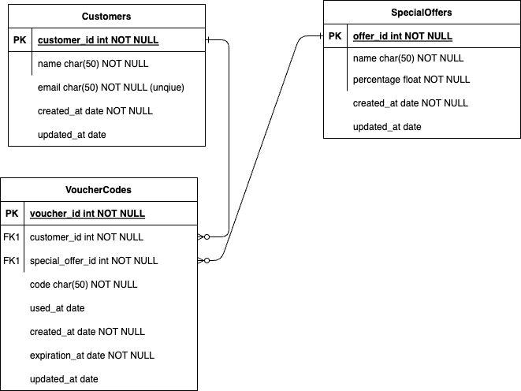
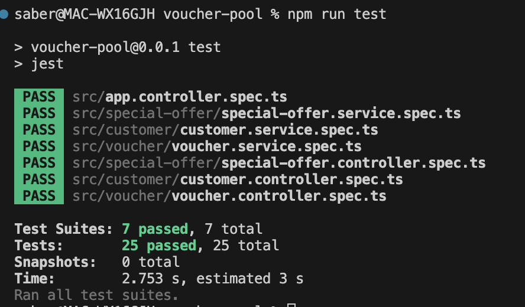

<p align="center">A voucher pool in NestJs.</p>

## Description

A voucher pool is a collection of voucher codes that can be used by customers to get discounts on website. Each code may only be used once, and we would like to know when it was used by the customer. Since there can be many customers in a voucher pool, we need a call that auto-generates voucher codes for each customer. Here’s a screenshot to give you an idea what it looks like:

## Installation

Make sure to have NodeJS & MySQL installed.
```bash
$ npm install
```

## Running the app

```bash
# development
$ npm run start

# watch mode
$ npm run start:dev

# production mode
$ npm run start:prod
```

### To-do list

* [x] Design a database schema
* [x] Write an application
* [x] API endpoint for verifying and redeeming vouchers
* [x] Implement API Rate Limiting: Protect the API from abuse by implementing rate limiting on the endpoints.
* [x] Use Database Transactions: Ensure data consistency by implementing use of transactions in your application.
* [x] Write unit tests
* [x] Using Typescript
* [x] A nice little Readme on how to run
* [x] Writing swagger for the API
* [x] Docker file to setup the whole application with all the dependencies (database, nodejs)


## Images


